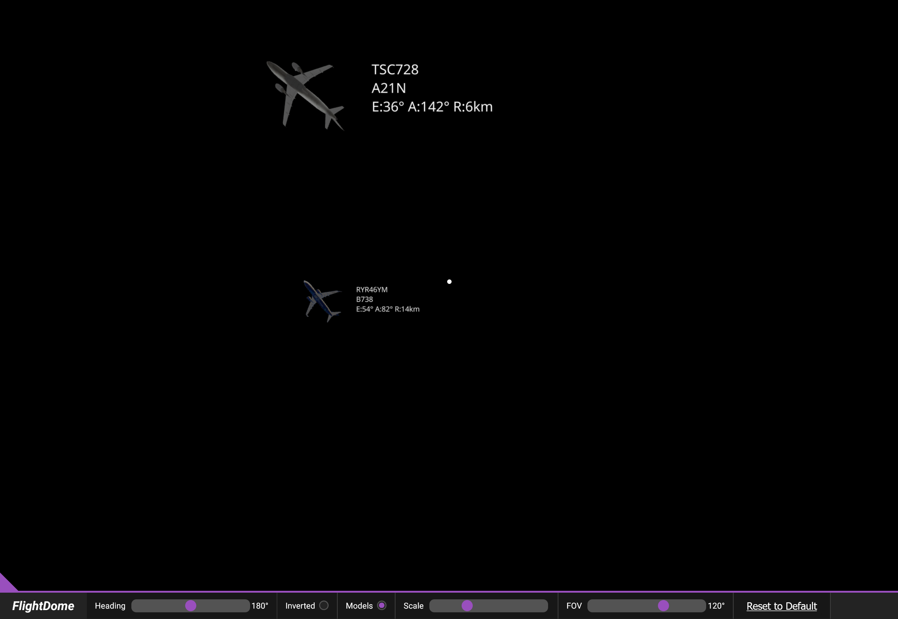
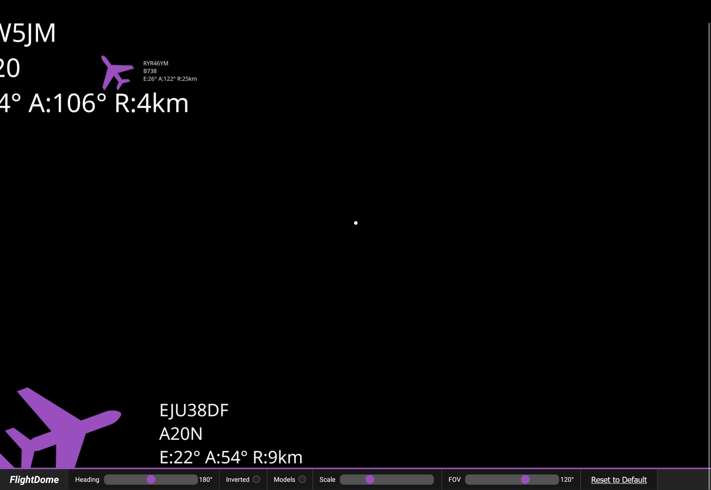

## FlightDome

FlightDome is a web-based sky dome displaying the aircraft above you. It fetches data from
[airplanes.live](https://airplanes.live) for the aircraft in your area. The program then displays these aircraft
using `THREE.js` and either a sprite model like a conventional flight radar or using the `Bluebell CSL` package, which 
I converted into the wavefront `.obj` file type at 
[isaacbarker/bluebell-cs-wavefront-obj](https://github.com/isaacbarker/bluebell-csl-wavefront-obj).

### Features
- Live aircraft locations above you
- Interpolation for smooth movement of aircraft
- Options to invert (for projecting on ceilings), change north alignment and size of aircraft
- Change between aircraft icon or real 3d model for many popular aircraft types

### Screenshots

